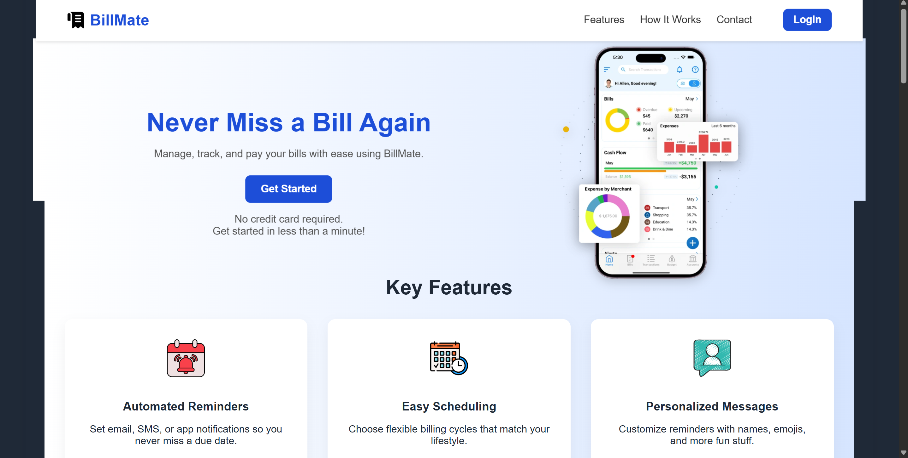
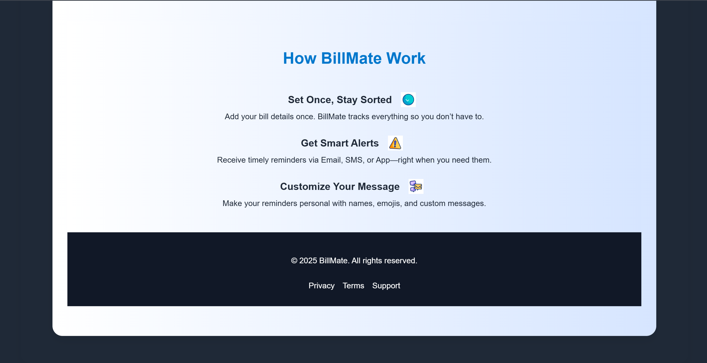
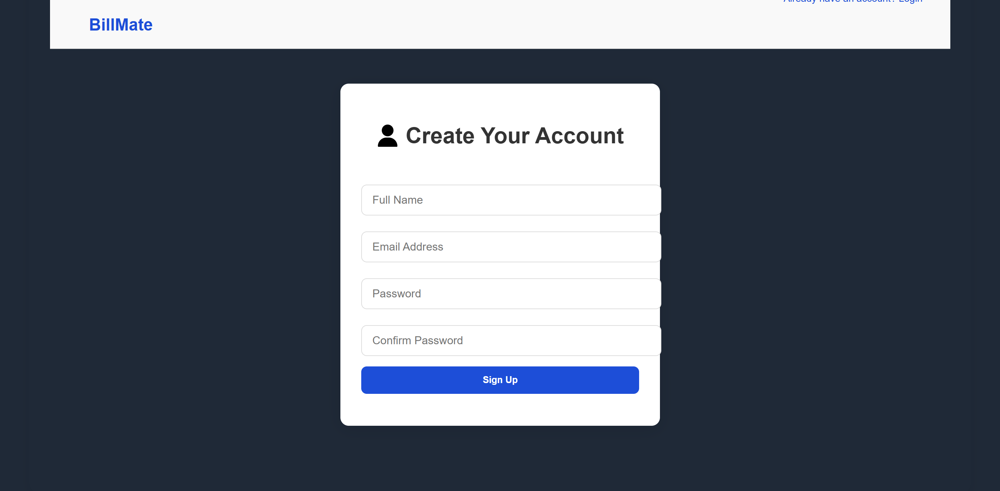

# *BillMate 💳🚀*
### Smart Bill Reminder & Scheduling System

BillMate is a clean and user-friendly bill management web app that helps users *track bills, **schedule reminders, and receive **personalized notifications*—all in one place.  
It is designed to make bill management simple, fast, and stress-free.

---

## *✨ Key Features*

### 🔔 *Automated Reminders*  
Never miss a due date again! BillMate sends timely reminders through:  
- 📧 *Email*  
- 📱 *SMS*  
- 🔔 *Smart app-like popups*  

---

### 📅 *Easy Scheduling*  
Choose billing cycles that match your lifestyle:  
- 🗓 *Custom due dates*  
- 🔄 *Auto-repeat cycles (Monthly / Quarterly / Yearly)*  
- ⏰ *Smart timing alerts*

---

### 💬 *Personalized Messages*  
Make reminders fun & unique with:  
- 🏷 Custom labels  
- 😀 Emoji support  
- ✨ Personalized templates  

---

## *🛠 Tech Stack*
- 🌐 *HTML* – Structure  
- 🎨 *CSS* – Styling & responsive layout  
- ⚡ *JavaScript* – Logic & validation  
- 🖼 *Font Awesome + PNGs* – Icons

- 📂 Project Structure
BillMate/
│── icons/
│── index.html
│── login.html
│── login.css
│── login.js
│── signup.html
│── script.js
│── style.css
│── README.md   ← (only this file is required for overview)

---

## Screenshots

### Homepage

### How It Works

### Scheduling

### Signup Page

🔮 Future Improvements

Mobile app integration

Push notifications

Cloud storage for bill history

Getting Started

Clone the repository:

git clone <https://github.com/priyanshukumar13/Billmate>

